# ShopFast — Django DRF E-commerce App with Real-Time Search

A Django backend for an e-commerce catalog with two ways to view data:

1. **Server-rendered Django templates** (`/products/`) — the main data-viewing
   UI. Pages are rendered by Django, and the search box does live,
   search-as-you-type filtering by fetching a re-rendered HTML fragment from
   the server (no client-side JSON/templating needed).
2. **JSON REST API** (`/api/...`, DRF) — for building other clients (mobile
   apps, SPAs, etc.), still available and fully working.

## Screenshots

These are from a real run of this app — real catalog, real bKash sandbox
payment, completed end to end.

**Browsing & search**

| Product list | Search-as-you-type |
|---|---|
| 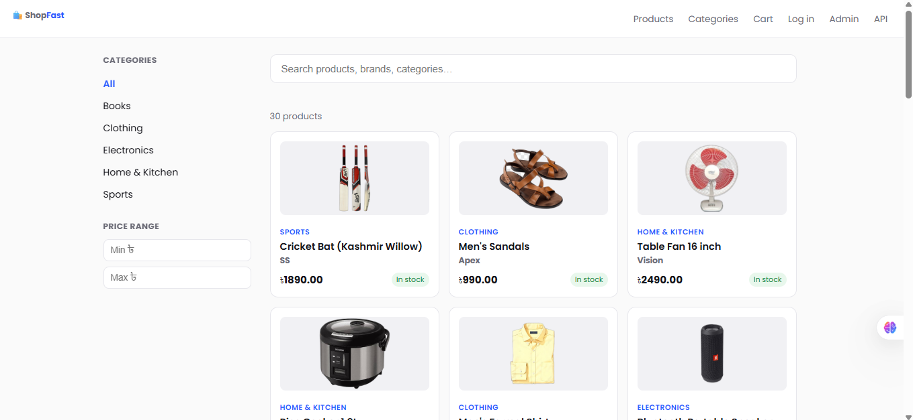 | 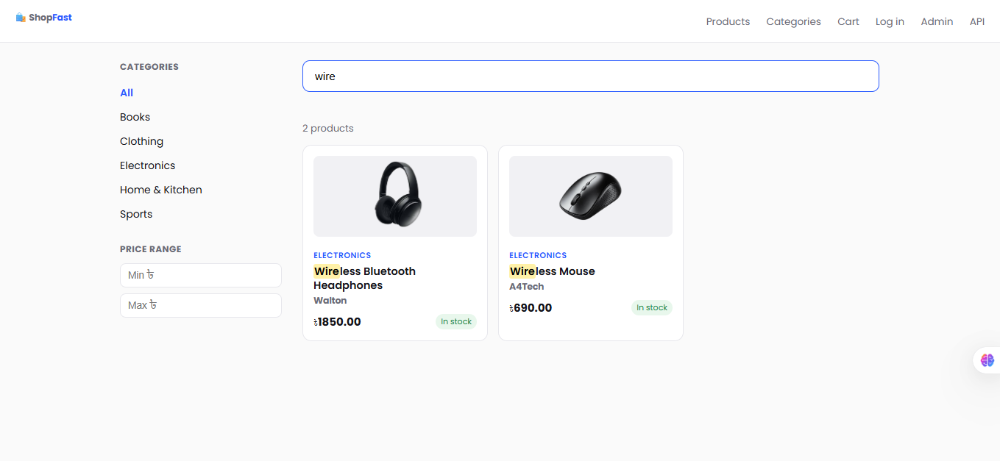 |

| Product detail | Cart |
|---|---|
| 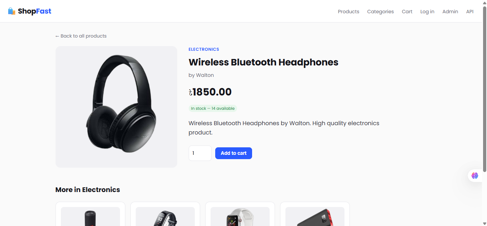 | 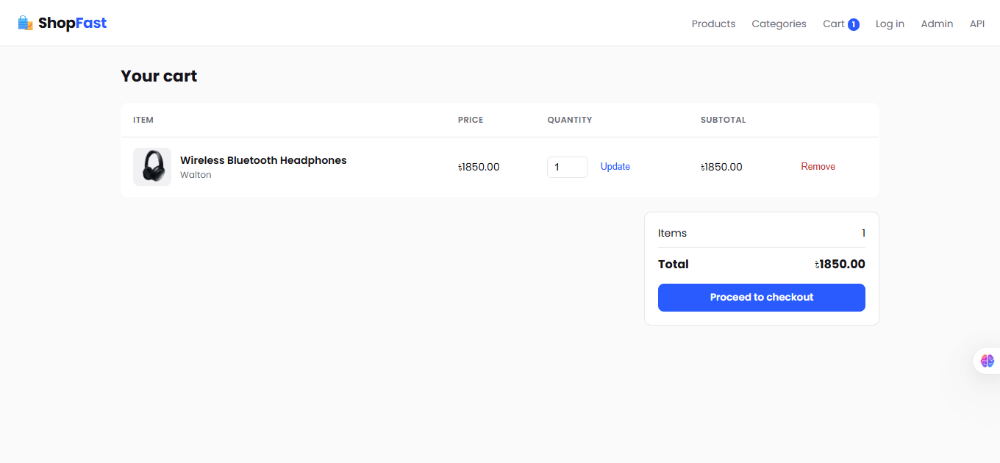 |

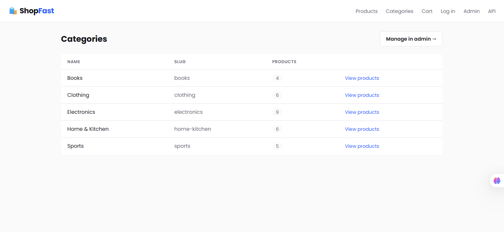

**Auth**

| Log in | Sign up |
|---|---|
| 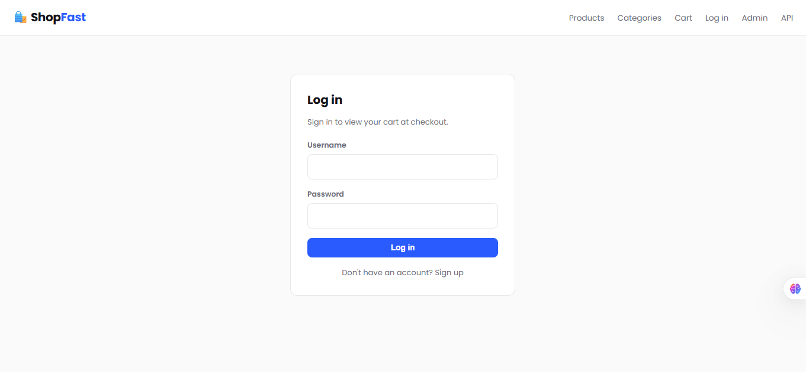 | 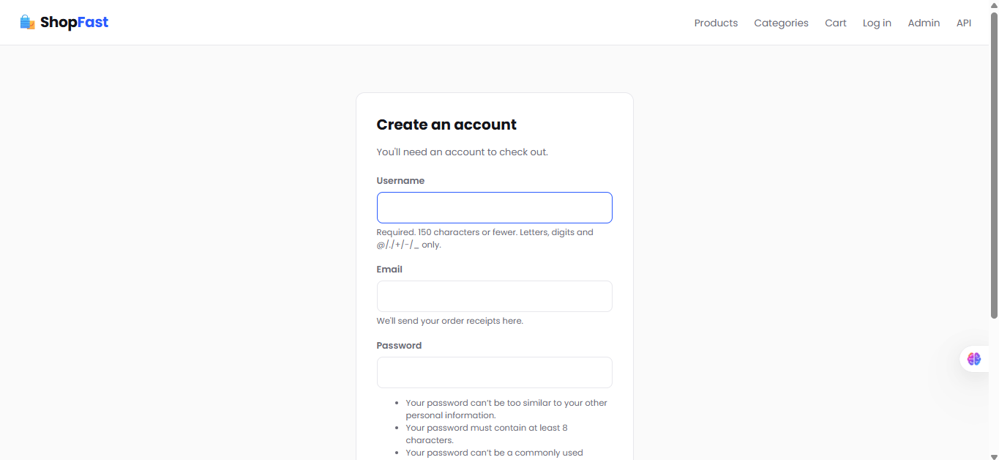 |

**Checkout & bKash payment — full flow**

| 1. Review order | 2. Confirm bKash number |
|---|---|
| 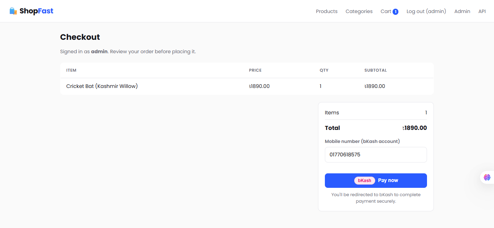 | 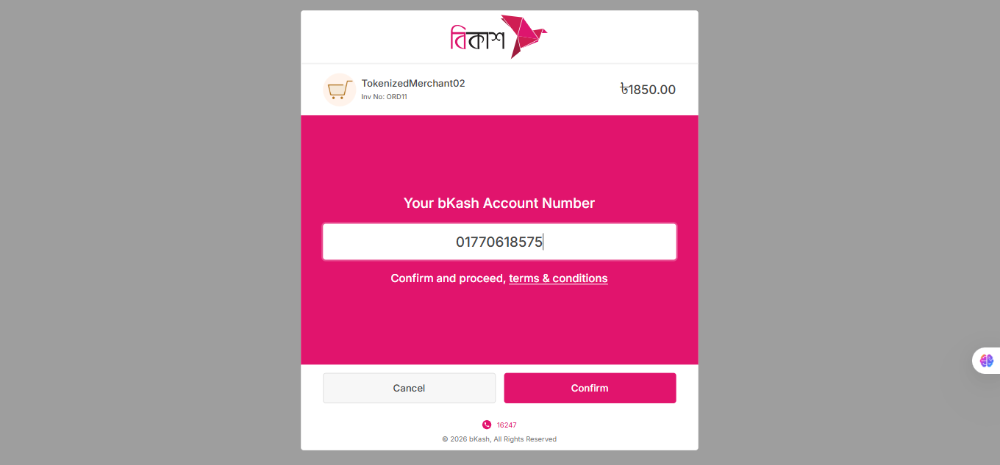 |

| 3. Enter OTP | 4. Enter PIN |
|---|---|
| 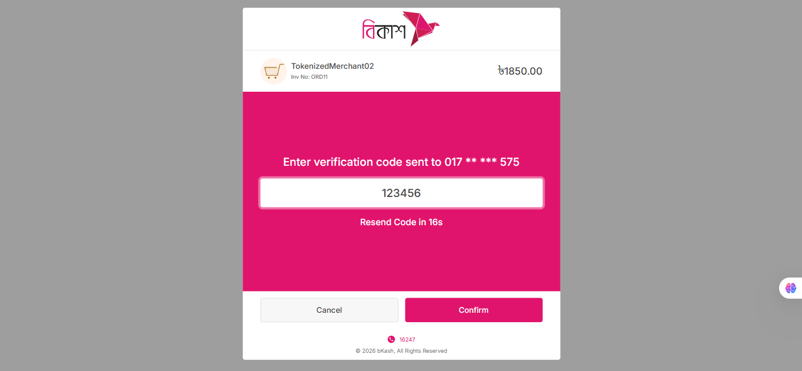 | 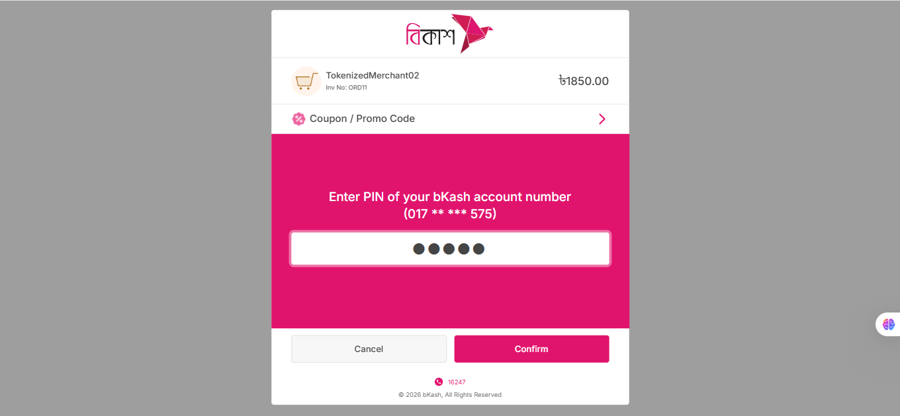 |

| 5. Verified, redirecting back | 6. Order confirmed |
|---|---|
| 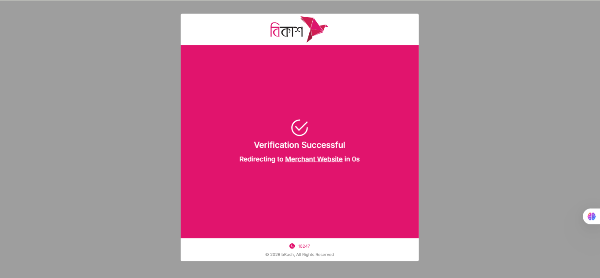 | 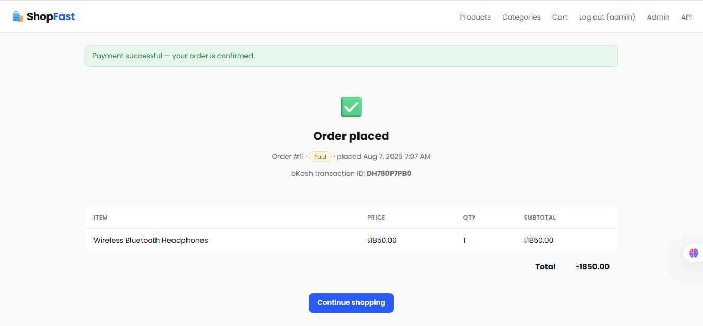 |

This last one is the proof that matters most: **Order #11, status
`Paid`, real bKash transaction ID `DH780P7PB0`** — Execute Payment
actually completing, not just Create Payment. See the Payments section
below for what this confirms.

<details>
<summary>Order confirmation email</summary>

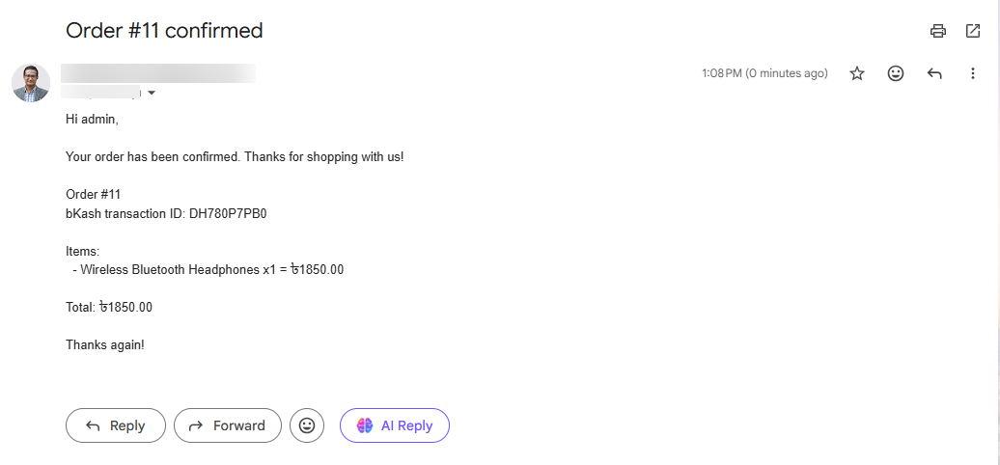

Implemented via `store/signals.py` + `store/receivers.py` (a signal fires
when an order is paid, a receiver listens and sends the email) and
`store/forms.py`'s `SignupForm`, which extends signup to collect an
email address for exactly this purpose. This was added independently of
the base build documented here — the exact signal/trigger logic lives
in those files, not described further in this README.
</details>

## Features

- **Products, Categories, Orders/OrderItems** models
- **Django-template data views** (`store/template_urls.py`):
  - `/products/` — product list with sidebar category + price filters
  - `/products/search/` — returns just the rendered results grid, called on
    every keystroke (debounced client-side)
  - `/products/<slug>/` — product detail page with related products
  - `/products/categories/` — **read-only** category list with live product
    counts. Adding, editing, and deleting categories is intentionally *not*
    exposed here — that's done through Django admin (`/admin/store/category/`)
    instead, which already gives you validated forms, permissions, and undo
    history for free.
  - Matched search text is highlighted server-side via a custom `highlight`
    template filter
  - `/products/cart/` — session-based shopping cart (works without login).
    Add from the product detail page, update quantities, remove items — see
    `store/cart.py`. The nav bar shows a live item count via a context
    processor (`store/context_processors.py`) registered in `settings.py`.
  - `/products/checkout/` — **requires login** (`@login_required`). Review
    the cart, place the order — this creates a real `Order`/`OrderItem`
    (reusing the models from the DRF API), decrements product stock, and
    clears the cart. Redirects to `/products/checkout/<id>/success/`.
  - `/accounts/login/`, `/accounts/signup/`, `/accounts/logout/` — auth.
    Login/logout use Django's built-in `LoginView`/`LogoutView` with custom
    templates; signup uses `SignupForm` (`store/forms.py`), extended beyond
    Django's default `UserCreationForm` to also collect an email address —
    used for order confirmation emails, see `store/signals.py` /
    `store/receivers.py`. Anonymous users hitting `/products/checkout/` get
    redirected to `/accounts/login/?next=/products/checkout/` and land back
    on checkout automatically after signing in (or signing up).
- **Payment: bKash Tokenized Checkout** (`store/payments/bkash.py`) —
  Bangladesh's mobile financial services gateway. See the "Payments" section
  below before trying to actually pay with it.
- **REST API** (DRF ViewSets + router): CRUD for products/categories, order creation
- **Real-time JSON search** — `GET /api/products/search/?q=...` (same ranking
  logic as the template view, but returns JSON — useful if you build a JS/SPA
  or mobile client against this backend later)
- **Autocomplete** — `GET /api/products/suggestions/?q=...` (distinct product names)
- **Filtering** — `?category=<slug>&brand=<name>&min_price=&max_price=&in_stock=true`
- **Pagination** built in on the API (12/page by default)
- **Design**: Poppins loaded globally via Google Fonts in `base.html` (every
  page inherits it — no per-template font-family overrides). Product images
  use `object-fit: contain` everywhere (grid cards, cart thumbnails, detail
  page, related products) so full product photos are always visible rather
  than cropped to fill a fixed box.

## Quick Start

```bash
python3 -m venv venv
source venv/bin/activate        # Windows: venv\Scripts\activate
pip install -r requirements.txt

python manage.py migrate
python manage.py seed_products   # optional — see note below
python manage.py createsuperuser # for /admin/ — this is how you'll actually
                                  # add your own products/categories with
                                  # real names, prices, and images

python manage.py runserver
```

**Note on sample data:** If you want something to look at immediately,
create a `seed_products.py` file at
`store/management/commands/seed_products.py` and run
`python manage.py seed_products` after `python manage.py migrate` — it
will load generic demo products across the given categories. It's
entirely optional — the intended way to populate the catalog is through
**Django admin** (`/admin/store/product/`), where you can add real
products with real images, as shown in the screenshots below. If you
don't run `seed_products`, the catalog just starts empty until you add
products yourself.

Checkout works without any extra setup for browsing/cart, but placing a
real order requires bKash credentials — see the **Payments** section
below and `.env.example`.

Then open:
- `http://127.0.0.1:8000/` — redirects to the product list page
- `http://127.0.0.1:8000/products/` — server-rendered product list with live search
- `http://127.0.0.1:8000/products/<slug>/` — product detail page
- `http://127.0.0.1:8000/api/` — browsable JSON API
- `http://127.0.0.1:8000/admin/` — Django admin

## Key API Endpoints

| Method | Endpoint | Description |
|---|---|---|
| GET | `/api/products/` | List products (paginated, filterable) |
| GET | `/api/products/search/?q=phone` | Real-time search |
| GET | `/api/products/suggestions/?q=pho` | Autocomplete names |
| GET | `/api/products/{id}/` | Product detail |
| POST | `/api/products/` | Create product (admin only) |
| GET | `/api/categories/` | List categories |
| GET/POST | `/api/orders/` | List/create orders (auth required) |

### Search example

```
GET /api/products/search/?q=wireless&limit=10

{
  "count": 2,
  "results": [
    {"id": 1, "name": "Wireless Bluetooth Headphones", "brand": "SoundCore",
     "price": "59.99", "category_name": "Electronics", ...},
    {"id": 5, "name": "Wireless Mouse", "brand": "KeyForge",
     "price": "24.99", "category_name": "Electronics", ...}
  ]
}
```

## Payments (bKash Tokenized Checkout v1.2.0-beta)

Docs: https://developer.bka.sh/docs/tokenized-checkout-overview
Base: `https://tokenized.sandbox.bka.sh/v1.2.0-beta/tokenized/checkout`

**A note on how this integration got here,** since it went through a
few false starts worth knowing about if something looks off: bKash has
several products with overlapping names (Tokenized Checkout v2,
Tokenized Checkout v1.2.0-beta, Checkout URL Based), each with a
different base host and slightly different field conventions. Earlier
versions of this integration targeted the wrong ones. **This version has
completed a real end-to-end sandbox payment** — see the Screenshots
section above — which is about as confirmed as this can get short of
production traffic. If you ever see a `paymentID`-related error again,
check you're still pointed at this exact base host and not a different
bKash product.

**1. Get sandbox credentials.** Register at https://developer.bka.sh and
create a sandbox app to get an **App Key**, **App Secret**, **Username**,
and **Password**.

**2. Configure them as environment variables:**
```bash
cp .env.example .env
# then edit .env with your real sandbox credentials
```
`settings.py` loads `.env` via `python-dotenv` — confirm `.env` sits
next to `manage.py`, not inside `ecommerce/` or `store/`, if values
don't seem to be picked up.

Official sandbox test values:
```
Wallet: 01770618575
OTP:    123456
PIN:    12121
```
Note: this is a shared public sandbox number, so it can occasionally
come back "wallet locked" from other people's testing — that's a
bKash-side sandbox state, not a bug here. Wait a bit and retry.

**3. The flow** (`store/views.py` + `store/payments/bkash.py`):

1. Shopper clicks **Pay now** on `/products/checkout/` → we create a
   `pending` `Order`, call bKash's **Grant Token** then **Create
   Payment** (with `"mode": "0011"` in the body — confirmed required),
   and redirect the whole browser to the `bkashURL` bKash returns.
2. Shopper pays on bKash's hosted page (`sandbox.payment.bkash.com`).
3. bKash redirects back to `/products/checkout/bkash/callback/` with
   `?paymentID=...&status=success|failure|cancel&signature=...`.
4. We check that `paymentID` matches what we stored in the session at
   step 1 (rejects tampered/replayed callbacks — signature verification
   itself isn't implemented, since the algorithm isn't in the docs I
   could access), then call **Execute Payment**. Only on
   `transactionStatus: "Completed"` do we mark the order `paid`,
   decrement stock, save `bkash_trx_id`, and clear the cart. Any other
   outcome marks the order `payment_failed` and leaves the cart
   untouched so the shopper can retry.

**What's confirmed — this is now fully proven end-to-end, not inferred.**
Every step of the flow — Grant Token, Create Payment, the redirect,
the callback, and **Execute Payment** — has been confirmed against real
sandbox requests, culminating in an actual completed payment: Order #11,
marked `Paid`, with a real bKash transaction ID (`DH780P7PB0`). See the
Screenshots section above for the full walkthrough. Execute Payment's
`{"paymentID": payment_id}` request body — the one piece that was
previously inferred by analogy rather than directly observed — is
confirmed correct by that successful transaction.

I tested the full Django-side state machine (order creation, callback
verification, stock/cart handling, all failure paths) using Django's
test client with the bKash calls mocked to match confirmed response
shapes, and the actual flow has now also been run live in the sandbox
successfully.

**To go live later:** switch `BKASH_BASE_URL` to bKash's production host
(`*.pay.bka.sh` instead of `*.sandbox.bka.sh`) and use live merchant
credentials — the code itself doesn't need to change.

## How the "real-time" part works (Django templates)

1. `store/product_list.html` listens for `input` events on the search box
   and the min/max price fields.
2. Each keystroke resets a 300ms debounce timer so we don't hit the server
   on every single character.
3. When the timer fires, `fetch()` calls `/products/search/?q=...&category=...`,
   using an `AbortController` to cancel any previous in-flight request — so a
   slow response for `"lap"` can never overwrite newer results for `"laptop"`.
4. Django renders `store/partials/product_grid.html` **on the server** with
   the filtered queryset and returns the HTML directly (not JSON).
5. The JS swaps that HTML straight into `#product-grid` — the matched
   substring is already highlighted server-side via the `highlight` filter
   in `store/templatetags/store_extras.py`.
6. The same `_filtered_products()` helper in `store/views.py` powers both
   the initial full-page render and the fragment endpoint, so there's only
   one place the filtering/ranking logic lives.

This same fragment-swap pattern is exactly what libraries like HTMX
formalize — the app doesn't use HTMX, but adding it later (e.g. swapping
raw `fetch()`+`innerHTML` for `hx-get`/`hx-trigger="keyup changed delay:300ms"`)
would be a drop-in replacement for the JS in `product_list.html`.

## Scaling the search further

The current search uses indexed `icontains` lookups on SQLite, which is
fine for demos and small catalogs. The endpoint's request/response shape
is designed so the *implementation* can be swapped without touching the
frontend:

- **PostgreSQL**: switch to `django.contrib.postgres.search`
  (`SearchVector`, `SearchRank`, or trigram similarity via `pg_trgm`) for
  proper full-text ranking and typo tolerance.
- **Dedicated search engine**: for large catalogs, front the same endpoint
  with Elasticsearch, Meilisearch, or Algolia and keep the product index
  in sync via Django signals or a periodic task.
- **WebSockets**: if you want server-pushed updates (e.g. live stock
  counts while a user searches), add Django Channels — the current setup
  already ships an `asgi.py` entrypoint to make that addition straightforward.

## Project structure

```
E_Commerce/
├── manage.py
├── requirements.txt               # incl. requests (bKash calls) + python-dotenv (.env loading)
├── .env.example                  # bKash credential template — copy to .env
├── docs/screenshots/              # README screenshots
├── ecommerce/
│   └── settings.py, urls.py, wsgi.py, asgi.py
├── store/
│   ├── models.py                 # Category, Product, Order (+ bKash fields), OrderItem
│   ├── forms.py                  # SignupForm — extends signup with an email
│   │                              # field, used for order confirmation emails
│   ├── signals.py                # fires on order payment (see receivers.py)
│   ├── receivers.py              # listens for that signal, sends the order
│   │                              # confirmation email (see screenshot below)
│   ├── cart.py                   # session-based Cart class
│   ├── context_processors.py     # exposes `cart` to every template
│   ├── payments/bkash.py         # bKash Tokenized Checkout API client
│   ├── serializers.py, filters.py  # DRF (JSON API)
│   ├── views.py                  # DRF ViewSets + Django-template views
│   ├── urls.py                   # /api/... (DRF router)
│   ├── template_urls.py          # /products/... (server-rendered pages)
│   ├── admin.py                  # CategoryAdmin, ProductAdmin — category
│   │                              # add/edit/delete happens here, not in templates
│   ├── templatetags/store_extras.py   # `highlight` filter for search matches
│   ├── management/commands/seed_products.py  # optional demo data
│   └── templates/
│       ├── registration/
│       │   ├── login.html
│       │   └── signup.html
│       └── store/
│           ├── base.html
│           ├── product_list.html     # list page + live search box
│           ├── product_detail.html   # add-to-cart form
│           ├── category_list.html    # read-only
│           ├── cart.html             # cart contents, qty update, remove
│           ├── checkout.html         # order review (login required)
│           ├── checkout_success.html # order confirmation
│           └── partials/product_grid.html  # shared by full page + AJAX fragment
```